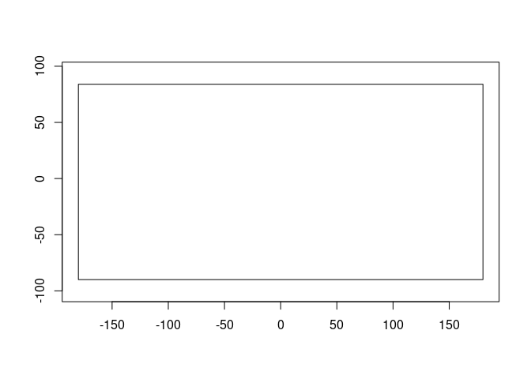
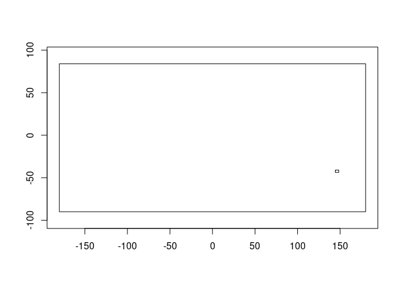
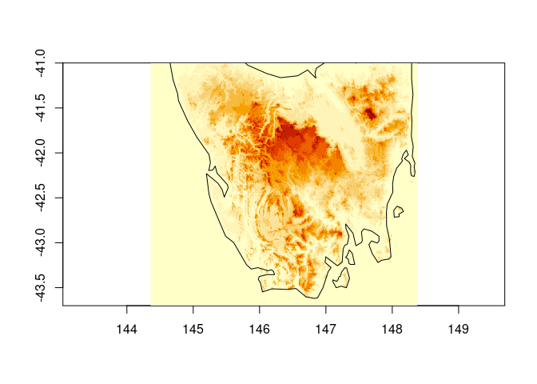
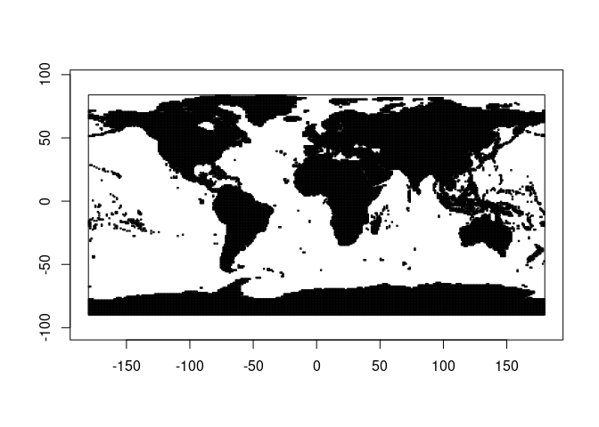

<!-- README.md is generated from README.Rmd. Please edit that file -->

# grainy

<!-- badges: start -->

[](https://github.com/mdsumner/grainy/actions/workflows/R-CMD-check.yaml)
<!-- badges: end -->

The goal of grainy is to encapsulate the logic of a raster grid in an
object.

## Installation

You can install the development version of grainy like so:

``` r
remotes::install_github("mdsumner/grainy")
```

## Example

This is a basic example which shows you how to solve a common problem:

``` r
library(grainy)
g <- grain$new(c(360, 180), c(-180, 180, -90, 90))
#> grain object
#> Dimension:  360x180
#>    Extent:  -180, 180, -90, 90 (xmin,xmax,ymin,ymax)
g$cell_from_xy(cbind(0, 0))
#> [1] 32581

## compare to raster/terra/stars/etc
#library(raster)
#cellFromXY(raster(extent(-180, 180, -90, 90), ncols = 360, nrows = 180), cbind(0, 0))
```

This means we can encapsulate this basic information and use it
conveniently.

``` r
u <- "/vsicurl/https://opentopography.s3.sdsc.edu/raster/COP30/COP30_hh.vrt"
## get information about a raster
info <- vapour::vapour_raster_info(u)

COP30 <- grain$new(info$dimension, info$extent)
#> grain object
#> Dimension:  1296005x626400
#>    Extent:  -180, 180, -90, 84 (xmin,xmax,ymin,ymax)
```

What is the extent of COP30?

``` r
COP30$plot_extent()
```



What exact region would we get from a vague query?

``` r
ex <- COP30$vcrop(c(144.3578, 148.374, -43.7, -41))

region <- grain$new(ex$dimension, ex$extent)
#> grain object
#> Dimension:  14459x9721
#>    Extent:  144.4, 148.4, -43.7, -41 (xmin,xmax,ymin,ymax)

COP30$plot_extent()
region$plot_extent(add = TRUE)
```



Let’s get that data but at reduced resolution.

``` r
reduced <- grain$new(region$dimension %/% 30, region$extent)
#> grain object
#> Dimension:  481x324
#>    Extent:  144.4, 148.4, -43.7, -41 (xmin,xmax,ymin,ymax)

v <- vapour::vapour_warp_raster_int(u, extent = reduced$extent, dimension = reduced$dimension)
str(v)
#>  int [1:155844] 0 0 0 0 0 0 0 0 0 0 ...

xyz <- reduced$listxyz(data = matrix(v, reduced$dimension[2], byrow = TRUE))
image(xyz, asp = 1/cos(mean(xyz$y) * pi/180), useRaster = TRUE)
maps::map(add = TRUE)
```



Treat the VRT like a list of files, and zoom in on our region for the
COG urls of interest.

``` r
u <- "/vsicurl/https://opentopography.s3.sdsc.edu/raster/COP30/COP30_hh.vrt"

## ok so what have we got
info <- vapour::vapour_raster_info(u)
exts <- vaster::extent_vrt(gsub("/vsicurl/", "", u))

g <- grain$new(info$dimension, info$extent)
#> grain object
#> Dimension:  1296005x626400
#>    Extent:  -180, 180, -90, 84 (xmin,xmax,ymin,ymax)
g$plot_extent()
region0  <- g$vcrop(c(144.3578, 148.374, -43.7, -41))

region <- grain$new(region0$dimension, region0$extent)
#> grain object
#> Dimension:  14459x9721
#>    Extent:  144.4, 148.4, -43.7, -41 (xmin,xmax,ymin,ymax)

rect(exts[,1] ,exts[,3], exts[,2], exts[,4])
```



``` r

## each row in  ext corresponds to an element in info$filelist[-1] so

files <- tibble::tibble(dsn = info$filelist[-1], xmin = exts[,1], xmax = exts[,2], ymin = exts[,3], ymax = exts[,4])

localfiles <- files |> dplyr::filter(xmin >= region$x_min(), xmax <= region$x_max(), 
                       ymin >= region$y_min(), ymax <= region$y_max())


## it's a bit quicker to use the only files involved, but not much

v <- vapour::vapour_warp_raster_int(localfiles$dsn, extent = region$extent, dimension = region$dimension)
#v <- vapour::vapour_warp_raster_int(u, extent = region$extent, dimension = region$dimension)
```

\`\`\` \## Code of Conduct

Please note that the grainy project is released with a [Contributor Code
of
Conduct](https://contributor-covenant.org/version/2/1/CODE_OF_CONDUCT.html).
By contributing to this project, you agree to abide by its terms.
